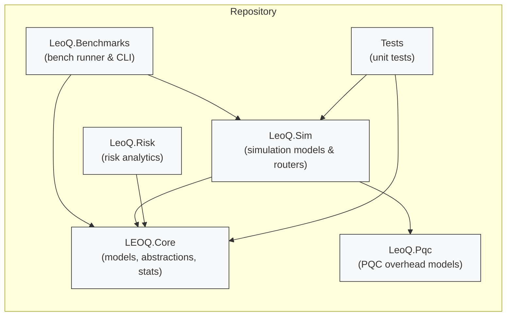
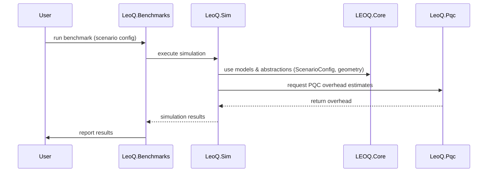

# Architecture Overview

This document contains high-level architecture diagrams for the `leo-q-framework` repository. The diagrams are provided as both Mermaid (GitHub-friendly) and PlantUML sources so contributors can view or render them locally or on CI.

## Mermaid component diagram

## Mermaid sequence example (bench run)

## Files included
- `architecture.puml` — PlantUML source for the component diagram (in same folder).
- `architecture.md` — this rendered Markdown with embedded Mermaid diagrams (GitHub renders Mermaid blocks on supported pages).
- `README.md` — instructions for rendering PlantUML locally or using online renderers.

If you want additional diagrams (deployment, class-level, sequence per feature) tell me which area to expand.
