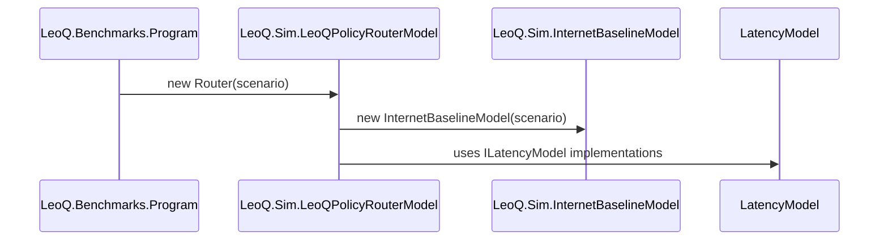

# Class Diagrams

This document contains class-level diagrams for the main types in the repository. Diagrams are provided as Mermaid (GitHub-friendly) and PlantUML sources so contributors can view or render them locally or in CI.

## Mermaid class diagram

```mermaid
classDiagram
  class ScenarioConfig {
    +string ScenarioName
    +double DistanceKm
    +int HopCount
    +int Seed
    +bool PqcEnabled
    +double DecisionSlaMs
  }

  class LeoPathGeometry
  class AggregateResult
  class LatencyStats

  class ILatencyModel <<interface>>
  class ICryptoOverheadModel <<interface>>

  class DeterministicRandom

  class LeoQPolicyRouterModel
  class InternetBaselineModel
  class LeoPathBaselineModel
  class SimplePqcOverheadModel
  class Program

  %% Relationships
  LeoQPolicyRouterModel --> LeoPathGeometry : uses
  InternetBaselineModel --> ScenarioConfig : reads
  LeoPathBaselineModel --> ScenarioConfig : reads
  LeoQPolicyRouterModel --> ILatencyModel : depends on
  InternetBaselineModel --> ILatencyModel : implements/uses
  SimplePqcOverheadModel ..|> ICryptoOverheadModel : implements
  LatencyStats <-- AggregateResult : aggregates
  DeterministicRandom --> ScenarioConfig : seeded-by
  Program --> LeoQPolicyRouterModel : instantiates
  Program --> InternetBaselineModel : instantiates

  %% Styling
  classDef core fill:#fefefe,stroke:#333,stroke-width:1px;
  class ScenarioConfig,LeoPathGeometry,AggregateResult,LatencyStats,ILatencyModel,ICryptoOverheadModel,DeterministicRandom core;
  classDef sim fill:#fbf7e6,stroke:#333,stroke-width:1px;
  class LeoQPolicyRouterModel,InternetBaselineModel,LeoPathBaselineModel sim;
  classDef pqc fill:#eef7ff,stroke:#333,stroke-width:1px;
  class SimplePqcOverheadModel pqc;
  class Program fill:#f6f6f6,stroke:#333,stroke-width:1px;
```

## Mermaid sequence (class instantiation example)



Files added:
- `class_diagrams.puml` — PlantUML class diagram source (same folder).
- `class_diagrams.md` — this file with Mermaid diagrams.
- `class_diagrams_README.md` — instructions for rendering PlantUML.

If you want a deeper class diagram (showing all properties/methods for a specific type), tell me which classes to expand.
